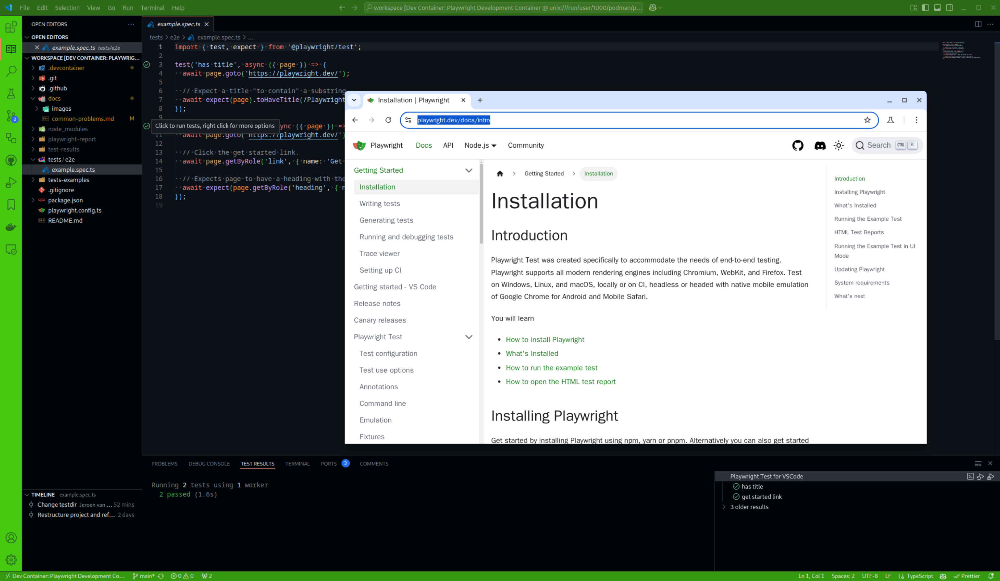

# test-automation-toolset

Toolset used for easy development of Playwright scripts. Utilizes the Devcontainer plugin in VSCode for easy setup.

Works on Windows and Linux (with some minor adjustments)

Supports both Wayland and Xorg display forwarding windows spawned in the container.

_Preview of running a test in headed mode using devcontainer environment and Playwright test for VSCode plugin. The window is spawned from within the container and displayed on the host computer._

## Last tested versions

### Linux version

- Distribution: Fedora Linux 41 (Workstation Edition)
- Kernel version: Linux 6.12.10-200.fc41.x86_64

---

### Windows version

- Edition Windows 11 Pro
- Version 24H2
- OS build 26100.2894

### Rancher Desktop version

- version 1.16.0

### VSCode version

- VSCode version: 1.96.4
- Decontainer plugin version: 0.394.0

### WSL version

- WSL version: 2.3.26.0
- Verify with: `wsl -v`

### WSL Linux distribution:

- Ubuntu 24.04.1 LTS
- Verify with: `cat /etc/os-release | grep PRETTY_NAME`
